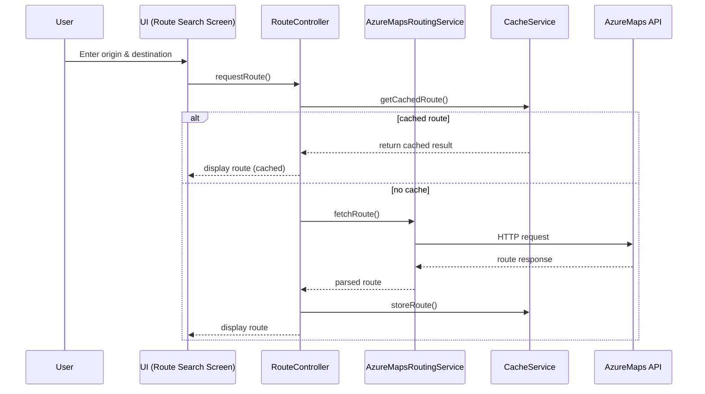
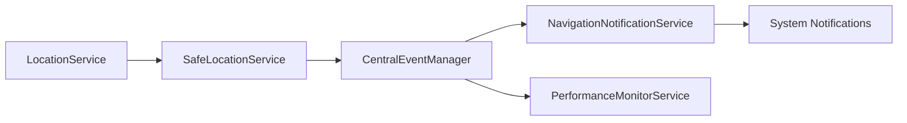

# HordMaps Comprehensive Documentation

**Version:** 1.0.0 | **Last Updated:** 2024-09-01

> This single Markdown file centralizes all documentation for the HordMaps project. Each section is designed to give contributors, maintainers, and end users a complete understanding of the application, its architecture, development workflow, and usage scenarios.

---

## Table of Contents

1. [Introduction](#introduction)
2. [Technical Requirements](#technical-requirements)
3. [Quick Start Guide](#quick-start-guide)
4. [Architecture](#architecture)
   1. [Core Technologies](#core-technologies)
   2. [Project Structure](#project-structure)
   3. [Service Architecture](#service-architecture)
   4. [State Management](#state-management)
   5. [Design Patterns](#design-patterns)
   6. [Data Flow Diagrams](#data-flow-diagrams)
5. [API Documentation](#api-documentation)
   1. [Documentation Expectations](#documentation-expectations)
   2. [Generating DartDoc](#generating-dartdoc)
   3. [Key Services](#key-services)
   4. [Code Examples](#code-examples)
6. [Developer Guides](#developer-guides)
   1. [Environment Setup](#environment-setup)
   2. [Azure Maps Integration](#azure-maps-integration)
   3. [Testing Guidelines](#testing-guidelines)
   4. [Debugging & Troubleshooting](#debugging--troubleshooting)
   5. [Build & Deployment](#build--deployment)
7. [User Documentation](#user-documentation)
   1. [Feature Overview](#feature-overview)
   2. [Accessibility Features](#accessibility-features)
   3. [FAQ](#faq)
   4. [User Troubleshooting](#user-troubleshooting)
8. [Code Examples & Use Cases](#code-examples--use-cases)
9. [Contributing](#contributing)
   1. [How to Contribute](#how-to-contribute)
   2. [Coding Standards](#coding-standards)
   3. [PR Review Process](#pr-review-process)
   4. [Issue Templates](#issue-templates)
   5. [Maintainer Guidelines](#maintainer-guidelines)
10. [Internationalization](#internationalization)
11. [Interactive Documentation](#interactive-documentation)
12. [Documentation Maintenance](#documentation-maintenance)
13. [Changelog](#changelog)
14. [Resources](#resources)

---

## Introduction

HordMaps is a **Flutter-based navigation platform** leveraging Azure Maps to deliver a modern, accessible, and highly customizable mapping experience. This document is optimized for Hacktoberfest participants, ongoing contributors, and end users who want an in-depth understanding of the system.

### Goals

- Provide a comprehensive single-source reference
- Onboard new contributors quickly
- Explain architecture and development processes
- Detail end-user functionality and accessibility features
- Outline documentation maintenance practices

---

## Technical Requirements

- **Flutter SDK:** 3.19.0 or higher
- **Dart SDK:** 3.3.0 or higher
- **Supported Platforms:** Android, iOS, Web, Windows, macOS, Linux (desktop builds)
- **IDE Recommendations:** Android Studio, Visual Studio Code
- **Azure Maps:** Active subscription with API key
- **Additional Tools:** Git, Markdown editor, DartDoc, optional PlantUML/Mermaid for diagrams

---

## Quick Start Guide

### Prerequisites

- Install Flutter SDK and ensure `flutter doctor` succeeds
- Set up Dart SDK (comes with Flutter)
- Install an IDE of choice (VS Code with Flutter extension recommended)
- Create an Azure Maps account and obtain an API key

### Installation Steps

1. **Clone the Repository**

   ```bash
   git clone https://github.com/yourusername/hordmaps.git
   cd hordmaps
   ```

2. **Install Dependencies**

   ```bash
   flutter pub get
   ```

3. **Configure Azure Maps**

   - Create `.env` based on `.env.example`
   - Set `AZURE_MAPS_KEY`
   - Alternatively, add a static config file:
     ```dart
     // lib/core/config/azure_maps_config.dart
     class AzureMapsConfig {
       static const String subscriptionKey = 'YOUR_AZURE_MAPS_KEY';
       static const String baseUrl = 'https://atlas.microsoft.com';
     }
     ```

4. **Run the Application**

   ```bash
   flutter run
   ```

5. **Build Commands**

   ```bash
   # Android
   flutter build apk --release

   # iOS
   flutter build ios --release

   # Web
   flutter build web
   ```

---

## Architecture

### Core Technologies

- **Flutter 3.19+** for cross-platform UI
- **Azure Maps API** for mapping, routing, geocoding
- **Provider** for state management
- **http, dio** for HTTP requests
- **shared_preferences, sqflite, ObjectBox (future)** for storage
- **flutter_map** for map rendering
- **flutter_local_notifications, flutter_tts** for background services and voice guidance

### Project Structure

```
lib/
├── core/                # Core configuration, themes, constants
├── features/            # Feature-centric modules (map, navigation, favorites, etc.)
├── controllers/         # State controllers / coordinators
├── models/              # Data models
├── screens/             # UI screens
├── services/            # Business logic and integration services
├── shared/              # Shared widgets, utilities
├── views/               # Composite UI views
└── widgets/             # Reusable UI components
```

- **core/config**: Environment and API configuration
- **services**: Communication with Azure Maps, location handling, performance monitoring
- **shared/services**: Utility services (caching, storage, analytics)

### Service Architecture

HordMaps follows a layered architecture:

- **Presentation Layer** (UI widgets, screens)
- **State Management Layer** (Provider, controllers)
- **Business Logic / Services Layer** (navigation, routing, caching)
- **Data Layer** (models, local storage, remote APIs)
- **Infrastructure Layer** (external services, platform channels)

Key services coordinate via the `AppServiceCoordinator` to ensure initialization and consistent state, with cross-service monitoring (event throttling, recovery mechanisms).

### State Management

- **Provider** pattern using `ChangeNotifier`
- Screen-specific providers under `features/<feature>/providers`
- `AppController`, `RouteController`, `SearchController` orchestrate cross-feature logic
- Global `CentralEventManager` for event bus pattern

### Design Patterns

- **Singleton**: `AppServiceCoordinator`, certain services
- **Observer/Event Bus**: `CentralEventManager`
- **Facade**: Services aggregating multiple API calls
- **Decorator / Strategy**: Throttling, performance monitoring services
- **Builder**: Complex widget composition (map overlays, quick action grid)

### Data Flow Diagrams

#### Route Planning (simplified)



#### Background Navigation Updates



---

## API Documentation

### Documentation Expectations

- Every **public class, method, property, and enum** must have DartDoc comments (`///`)
- Include **parameter descriptions**, **return values**, and **example usage** for complex logic
- Document edge cases, errors, and expected behavior

### Generating DartDoc

1. Activate DartDoc (if not already)

   ```bash
   flutter pub global activate dartdoc
   ```

2. Generate documentation

   ```bash
   dart doc
   ```

3. Output is placed under `doc/api/`
4. Host or reference the generated HTML via GitHub Pages or local readme links

**Optional:** Add `dartdoc_options.yaml` with categories for services, controllers, widgets, etc.

### Key Services

- **`AppServiceCoordinator`**
  - Manages initialization/shutdown of all services
  - Monitors system health, handles coordinated cleanup
- **`AzureMapsRoutingService`**
  - Connects to Azure Maps REST endpoints for routing
  - Handles API keys, HTTP errors, rate limiting
- **`SafeLocationService`**
  - Wraps location updates with recovery, fallback strategies
- **`PerformanceMonitorService`**
  - Tracks event load, CPU/memory usage (future expansions)
- **`EventThrottleService`**
  - Prevents event overload by throttling high-frequency updates

### Code Examples

#### Example: Calculating a Route

```dart
final routeController = RouteController();
await routeController.calculateRoute(
  origin: LatLng(47.6062, -122.3321),
  destination: LatLng(47.6205, -122.3493),
  mode: TransportMode.walking,
);
```

#### Example: Listening to Navigation Updates

```dart
final navigationService = NavigationService();
navigationService.startListening(onUpdate: (data) {
  // Update UI with current turn instruction
});
```

---

## Developer Guides

### Environment Setup

1. Ensure Flutter SDK is installed and added to PATH
2. Run `flutter doctor`
3. Install IDE plugins (VS Code: Flutter, Dart; Android Studio: Flutter plugin)
4. Configure `.env`
5. Run sample tests to validate environment:
   ```bash
   flutter analyze
   flutter test
   ```

### Azure Maps Integration

- Sign in to [Azure Portal](https://portal.azure.com)
- Create an Azure Maps account and retrieve **Primary key**
- Store the key securely (`.env`) and never commit to version control
- Limits and quotas: document usage per tier

#### Sample API Call

```dart
final routingService = AzureMapsRoutingService();
final route = await routingService.getRoute(
  origin: LatLng(47.6062, -122.3321),
  destination: LatLng(47.6205, -122.3493),
);
```

### Testing Guidelines

- Use **`flutter test`** for unit and widget tests
- Recommended structure:
  - `test/controllers/...`
  - `test/services/...`
  - `test/widgets/...`
- Mocks: Use `mockito` or `dart:async` for simulating asynchronous flows

#### Unit Test Example

```dart
import 'package:flutter_test/flutter_test.dart';
import 'package:hordmaps/services/azure_maps_routing_service.dart';

void main() {
  group('AzureMapsRoutingService', () {
    late AzureMapsRoutingService service;

    setUp(() {
      service = AzureMapsRoutingService();
    });

    test('returns a route for valid coordinates', () async {
      final route = await service.getRoute(
        origin: LatLng(47.6062, -122.3321),
        destination: LatLng(47.6205, -122.3493),
      );

      expect(route.distance, greaterThan(0));
    });
  });
}
```

### Debugging & Troubleshooting

- Enable verbose logging using `debugPrint`
- Monitor performance in Flutter DevTools
- Check background services (Android: `adb logcat`)
- Common issues:
  - Permissions denied → ensure runtime permission requests
  - API key mismatch → validate environment variables
  - Location updates not working → check device settings, emulator capabilities

### Build & Deployment

- **Android:** Ensure `android/app/build.gradle` is configured for release keystore
- **iOS:** Update `Runner/Info.plist` with usage descriptions for location, camera
- **Web:** Configure `web/index.html` for PWA capabilities
- **CI/CD:** Use GitHub Actions to run `flutter analyze`, `flutter test`, and build artifacts

---

## User Documentation

### Feature Overview

- **Navigation:** Real-time routing, voice turn-by-turn, route recalculation
- **Favorites:** Save locations, categorize, sync (future)
- **Map Controls:** Zoom, measurement tools, overlays
- **Sharing:** Share routes via links or QR codes
- **Background Services:** Persistent navigation with notifications
- **Offline:** Tile caching and fallback (partial support)

#### Quick Usage Flow

1. Launch app and accept location permissions
2. Search for a destination
3. Tap **"Directions"**
4. Choose transport mode
5. Tap **"Start"** to begin navigation

### Accessibility Features

- **High-contrast mode** (future enhancement)
- **Large tap targets** for key controls
- **Voice guidance support** using `flutter_tts`
- **Screen reader labels** on UI elements (ongoing improvements)
- Document testing with TalkBack (Android) and VoiceOver (iOS)

### FAQ

- **How do I reset the map view?** Tap the location button in the bottom-right corner.
- **Why do I see "API key invalid"?** Check if the Azure Maps key is correctly configured.
- **Can I use HordMaps offline?** Limited offline support through cached tiles; full offline routing is planned.

### User Troubleshooting

- **Location not updating:** Ensure GPS is enabled and permissions granted.
- **Slow map loading:** Check network connection and API rate limits.
- **Voice guidance not playing:** Verify device volume and TTS permissions.

---

## Code Examples & Use Cases

### Navigation

```dart
final navigationView = NavigationView(
  route: currentRoute,
  onStop: () => navigationService.stop(),
);
```

### Favorites

```dart
context.read<FavoritesController>().addFavorite(
  FavoriteLocation(
    name: 'Home',
    coordinates: LatLng(40.7128, -74.0060),
  ),
);
```

### Azure Maps Integration

```dart
final placesService = PlacesService();
final results = await placesService.searchPlaces('coffee');
```

### Testing

```dart
testWidgets('HomeScreen shows map and controls', (tester) async {
  await tester.pumpWidget(const HordMapsApp());
  expect(find.byType(FlutterMap), findsOneWidget);
  expect(find.byIcon(Icons.my_location), findsOneWidget);
});
```

---

## Contributing

### How to Contribute

1. Fork the repository
2. Create a feature branch (`git checkout -b feature/amazing-feature`)
3. Commit changes (`git commit -m "feat: add amazing feature"`)
4. Push (`git push origin feature/amazing-feature`)
5. Open a pull request

### Coding Standards

- Follow [Effective Dart](https://dart.dev/guides/language/effective-dart)
- Use descriptive class and method names
- Maintain small, focused functions
- Document public APIs with comments
- Keep code formatted (`dart format .`)

### PR Review Process

- Ensure `flutter analyze` and `flutter test` pass
- Update documentation for any API or feature changes
- Include screenshots for UI modifications
- Expect at least one maintainer review

#### PR Checklist (suggested)

- [ ] Flutter analyze passes
- [ ] Tests added/updated
- [ ] Documentation updated
- [ ] Screenshots (if UI changes)

### Issue Templates

- **Bug reports:** Steps to reproduce, expected behavior, device info
- **Feature requests:** Problem statement, proposed solution, alternatives
- **Documentation:** Area of docs, suggested changes, references

### Maintainer Guidelines

- Triage issues within 48 hours
- Label incoming issues (bug, enhancement, documentation)
- Merge only when CI passes
- Maintain release cadence (monthly minor, as-needed patches)

---

## Internationalization

- Document language support strategy (en-US default)
- Provide ARB files for translations (future enhancement)
- Outline translation workflow:
  1. Update ARB
  2. Regenerate localization delegates
  3. Test with active locale (`flutter run --dart-define=locale=fr`)
- RTL support: ensure layout mirroring, icon adjustments
- Cultural considerations: units (metric vs imperial), map symbols, language tone

---

## Interactive Documentation

- **Interactive Code Examples:** Plan DartPad links for key components
- **Live Documentation Site:** Use MkDocs or Docusaurus to render this Markdown into a web-friendly site (future work)
- **Video Tutorials:** Host on YouTube/Vimeo, link here with transcripts
- **API Explorer:** Build a simple Flutter Web page (future) to test routes with mock data
- **Search Functionality:** When moving to a static site, integrate Lunr.js or Algolia DocSearch

---

## Documentation Maintenance

- Add documentation tasks to PR template
- Schedule quarterly documentation audits
- Use Markdown linting (`markdownlint`) and link checkers (`lychee`) in CI
- Track documentation-related issues with the `documentation` label
- Maintain this file as a living document—update **Last Updated** section on every major change

---

## Changelog

| Date       | Version | Section               | Summary                                     |
| ---------- | ------- | --------------------- | ------------------------------------------- |
| 2024-09-01 | 1.0.0   | Initial Documentation | Created consolidated documentation skeleton |

---

## Resources

- [Flutter Documentation](https://docs.flutter.dev/)
- [Azure Maps Documentation](https://learn.microsoft.com/azure/azure-maps/)
- [Effective Dart](https://dart.dev/guides/language/effective-dart)
- [DartDoc](https://dart.dev/tools/dartdoc)
- [Markdown Guide](https://www.markdownguide.org/)
- [Hacktoberfest](https://hacktoberfest.com/)

---

**Happy mapping!** 🌍🚀
